## 三、 理论概念
在很多书籍中，前面都会跟大家讲**HTML**和**CSS**的一些发展史，然后再讲什么**web标准**之类的理论性的东西，对于这类东西，看来看去也就那样，无非就是说各大浏览器厂商什么什么，W3C组织成员怎么怎么啦之类的blablabla一堆。这些东西如果大家有兴趣，就百度一下，或者看一下[维基百科](https://zh.wikipedia.org/wiki/%E7%B6%B2%E9%A0%81%E6%A8%99%E6%BA%96)也可以，历史课我一向不及格，肯定说不好什么。

### №3.1 CSS特性
提到**CSS**的特性，可以从**CSS**的全称上了解到一些。

* 英文全称：Cascading Style Sheets
* 中文全称：层叠样式表

从这个名称中我们可以得到一个关键词就是**层叠**，拥有**层叠**特性的**CSS**可以让我们在编码的时候去自由组合，从而得到一些属性的`继承`、`叠加`，以及我们可以去`覆盖`一些样式属性。

#### №3.1.1 继承
所谓继承无非就是儿子得到老子的一些东西，那么在**HTML**中我们所要知道就是父级和子级的关系存在。

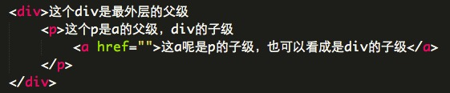

就这么一个简单的层级嵌套，我们可以得到的信息就是图中所描述的一样：`div`包含了`p`，然后`p`又包含了`a`，就这样一层层嵌套下来，形成了父级与子级的关系。那么在我们写**CSS**的时候，这个嵌套对样式又有什么影响呢？

假设我们写了一个样式如下：

	div {
		color: #FF0000;
	}
	
这个代表着的是我们要让`div`标签中的文本颜色是**红色**，那么我们得到的结果就会是这样：

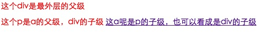

可以看到p标签中的文字颜色也变成了红色，这就是**继承**。细心的你或许看到了，那为什么`a`标签里的文字没有继承`div`的红色呢，`a`难道不是`div`的子级元素吗？不，`a`是`div`的自己元素，而且`a`其实也继承`div`的红色属性，只不过这个时候的`a`有另外一种情况发生了，这就是下面要说的**覆盖**。

#### №3.1.2 覆盖
所谓的**覆盖**就是通过选择符的优先权重级别（后续会提到这个权重）来加强当前标签的**CSS**属性，前面提到的`a`标签就是有这个情况，虽然我们没有定义这个标签的样式，但是浏览器在自带的默认样式中有一些样式代码，从而导致`a`看起来没有继承`div`的属性。

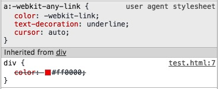

从这个截图中我们可以看到，`div`标签中的红色被删除~~`color: #ff0000;`~~，而上面还有一个`color: -webkit-link;`属性存在。其实这个就是因为**CSS**的覆盖特性导致的。

而如果我们把`color: #FF0000`定义在`a`标签上，那么情况就又变了，这个时候`a`的文字颜色变成红色了，样式覆盖的对象就变了。

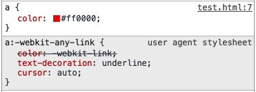

> 这里`a:-webkit-any-link`的属性相对比较特殊，牵扯到了**user agent stylesheet**（用户代理样式），这个主要是浏览器默认的样式，需要针对性去定义才能覆盖原有的样式，而无法通过继承的方式去修改。

#### №3.1.3 叠加
所谓**叠加**从字面上其实我们也可以猜到一二了，简单来说就是把几个属性值累加在一起。比如我们的**HTML**结构是这样的：

	
在这个p标签上还有一个类名是 text 

	
这个p标签上是没有类名的

	
那么假如我们给`p`标签定义了一个样式，让文字变成红色：

	p {
		color: #FF0000;	/* p标签的文字颜色是红色 */
	}

我们得到的效果就是这样的：

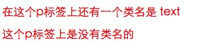

这个时候我们再给`.text`这个类名增加一些样式：

	.text {
		font-weight: bold;	/* .text这个类名的标签中的文字加粗 */
		text-decoration: underline;	/* .text这个类名的标签中的文字有下划线 */
	}
	
这样我们就可以看到有`.text`这个类名的`p`标签上的文字样式就相对应的增加了，而没有`.text`这个类名的`p`标签还是保持着一个简单的红色文字，并没有加粗和下划线的出现。

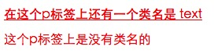

### №3.2 基本语法
在**CSS**也不知道是不是该叫语法，毕竟**CSS**不属于编程语言，只是**没有逻辑的描述型语言**。语法这个词或许真的是有点不合适，一般有人叫“规则”，不过无论叫什么，暂且跳过，我们就先叫语法吧。**CSS**的基本语法很简单，主要是有两部分组成：**选择符**和**属性声明**。

* **选择符**有多种表现形式，后续我们会谈到一些常用和不常用的一些选择符，至于一些目前还在*开发*阶段的可用性几乎为零的选择符就不会去提到；
* **属性声明**主要是有属性和属性值两种组成，并且通过冒号`:`隔开，属性值后面用分号`;`结束；

选择符的表现方式有多种，暂且先跳过，后续做说明。对于属性声明这块，在`{}`花括号内的最后一个属性值是可以不需要在后面带上分号`;`的，就比如：`.className { color: #FF0000 }`和`.className { color: #FF0000; }`是相同的，唯一的差别就是最后一个分号`;`是否存在。

#### №3.2.1 注释
任何一种代码都存在着注释，合理的注释能够给后期自己看代码的时候带来很多便利，如果是在团队中多人合作的话，也能让其他成员更清晰知道某段或者某行的代码作用。那么在**CSS**中的注释是什么呢，很简单，只需要使用`/* */`包含就可以了。

以`/*`开始，`*/`结束，这中间你可以用多行的形式来描述，也可以直接一行的方式来描述，并且注释的内容也可以在`{}`内部出现，只要不断开属性与属性值，基本上来说就没事，要不很有可能会让别人浏览器误以为是某些特殊性的属性声明，导致解析错误。

正确的注释方式：

	/* 
		这里将开始一段多行注释
		看到的内容都是注释
		不会影响到任何东西，因此可以做详细的CSS说明
	*/
	p {color:red;}
	/* 然后也可以是单行的一个注释，做简单的说明 */
	strong {color:green; /* 如果你愿意的话，也可以在这里加注释 */ font-size:12px;}
	
合理的使用注释，能够给你的代码带来更大的可读性，但也别盲目使用无意义的注释。

> 最后发布代码上线的时候，可以使用第三方工具将你的注释删除，从而减小代码文件。文件越小，用户那边加载肯定也是越快。

### №3.3 引用方式
当我们在编写页面的时候，调用**CSS**的方法一般来说有四种，不过常用的就三种方式：

* `link`标签的引入；
* `style`标签的插入；
* **HTML**中的`style`属性方式插入；
* **CSS**中的`@import`方式导入，这种方式目前使用的情况比较少，一般会在**SASS**/**LESS**等一些工具中使用，然后还有一些在本地环境中，以及多人配合联调的时候通过**CSS**来加载其他样式，可能会用到，在线上的网页中已经很少见到了；

#### №3.3.1 `link`标签的引入
这种方式引入的**CSS**一般是引入一个`.css`的文件，如：

	<link rel="stylesheet" href="style.css">
	
直接引入一个`style.css`的文件，所有的**CSS**样式都是在这个文件中，通过选择符来匹配**HTML**中相对应的标签元素。

需要注意的是，`link`标签一般都是在**HTML**代码中的`head`标签内，如：

	<head>
	<meta charset="UTF-8">
	<title>Document</title>
	<link rel="stylesheet" href="style.css">
	</head>

而在`head`标签内还包含了其他更多的一些标签，大部分都是一些说明性或者是网页某些特殊功能性的标签，当然也可以包含调用`JavaScript`的标签，这里就不多提了，关键是大家知道`link`标签主要是在什么地方出现就可以了。当然，在`link`标签中还有一些属性，比如`media`之类的，我们也就暂且跳过了，有兴趣的朋友可以打开这个网页看一下[http://w3school.com.cn/tags/tag_link.asp](http://w3school.com.cn/tags/tag_link.asp)。

#### №3.3.2 `style`标签的插入
在**HTML**页面代码中直接使用`style`标签插入，并包含相对应的**CSS**内容即可，后续该文档中提到的方式都是以这种方式来做说明。这种方式比较适合单页面或者CSS内容比较少的情况下去使用，因为当我们使用了`style`标签插入的话，仅对当前页面有效，而通过`link`方式调用的话，只要有调用的页面都会有效，在做网站的时候，还是推荐使用`link`的方式引入**CSS**文件。

	<head>
	<meta charset="UTF-8">
	<title>Document</title>
	
	</head>

那么这个`style`标签的插入呢，一般我们也是放在`head`标签内，然后在`style`标签中就是写我们所需要的**CSS**内容就可以了。

#### №3.3.3 **HTML**中的`style`属性方式插入
一般来说不太建议这样操作，**CSS**最初的作用是是为了能够更好的可复用性的去修饰**HTML**标签，让页面变得更漂亮，而如果我们使用这种方式的话，那么就只能针对当前的某个标签起作用，对其他标签是没有任何效果，比如：

	
这里是有没有style属性的

	
增加style属性来改变样式

	
当页面中出现这样的**HTML**代码时，虽然我们看到`style`属性中的内容跟我们在其他两种方式中写的**CSS**很类似（缺少了`{}`花括号和**选择符**），但还是会有作用。可这个方式仅仅只能针对该`style`属性值所在的**HTML**标签有效，效果如下：

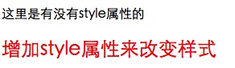

虽然效果有，可维护性就变得很差了，所以这种方式能不用就不要用了。

#### №3.3.4 **CSS**中的`@import`方式导入
评价最差的一种方式，大家知道一下就可以了，能用也不要用，改为`link`标签引入的方式吧。有兴趣的朋友看这里[http://www.jb51.net/css/67778.html](http://www.jb51.net/css/67778.html)了解一下就好了。

### №3.4 权重优先级
鉴于**CSS**的特性，在我们考虑使用怎么触发**CSS**属性的时候，也就是我们通过哪种**选择符**的方式让**HTML**中相对应标签有样式时，要稍微有所考虑，否则你会发现最终的效果或许并不是你想要的，但是样式其实已经起作用了，但却被别的给覆盖了。那么这就是我们所要讲的权重优先级。

#### №3.4.1 **CSS**的来源
所谓的**CSS**来源，其实就是浏览器在解析网页的时候，会从什么地方获取**CSS**代码来修饰我们的页面。这来源主要有三种途径：

1. **user agent stylesheet** 用户代理的默认**CSS**，也就是浏览器默认的一些样式，在前面我们提到的**覆盖**特性中有一个截图可以看到右上角是有一个灰色的标记所代表就是[浏览器的内置样式表](http://developer.doyoe.com/default-style/)；

	

2. **author style sheets** 开发者定义的**CSS**，也就是我们作为一个开发人员所编写的代码在被引入到页面后的样式；
3. **user style sheets** 用户自定义的**CSS**，用户通过浏览器的第三方插件或者浏览器自带的一个插入样式表的功能所加载的样式，这类用户一般有这么几种：
	* 安装第三方浏览器插件来改变某些网站的样式，比如[https://userstyles.org/styles/72212/v6](https://userstyles.org/styles/72212/v6) 这个通过 [Stylish](https://userstyles.org/) 插件增加了样式后，针对[新浪微博](http://weibo.com/linxz428/)首页做了一些处理，去掉一些广告顺带改变了一下页面布局；
	* 安装某些软件通过**HTML**中的一些关键词屏蔽了广告；
	* ~~用户获取的**CSS**文件或者自己编写的**CSS**样式，直接通过浏览器的菜单来加载~~。记得很早之前浏览器中是有看到过，但现在我却没在 OS X 系统中发现这个菜单，或许是记错了，也或许在 windows 系统中可以找到，有兴趣的朋友可自行查找一下，比如 windows 下的IE选项设置中；
	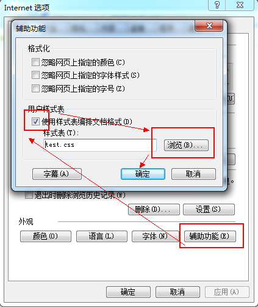
	
简单来说，就是用户如果通过其他方式加载了**CSS**样式，那么可以修改任何网页的页面布局，而作为网页开发者来说，是可以覆盖*部分*浏览器内置的样式。

> 注意：这里提到开发者的样式可以覆盖*部分*浏览器内置的样式，主要体现在表单元素中，比如`select`标签是最显著的，尤其是在**IE**浏览器中，特别是低版本的**IE**浏览器。

#### №3.4.2 需要注意的`!important`特殊性
> 这种处理是对 `user` 和 `author` 权限的平衡，一般情况下 `author` 的权重高于 `user`，这是对 `author` 创作的尊重；但对于**特殊用户**（例如：色盲、色弱、近视用户），他们具有**特殊需求**（例如 大字号、特定的颜色对比），这种需求可以通过 `user !important` 声明来获得最高优先级。

所以，对于前面提到**CSS**来源的优先级，在基于`important`的前提下，优先级排列应该是这样：

1. user agent declarations
2. user *normal* declarations
3. author *normal* declarations
4. author **important** declarations
5. user **important** declarations

> **纠正：** 来源 [hbkdsm](https://github.com/hbkdsm) 的提示，以上的顺序有误，纠正如下，有兴趣的朋友可以打开这个页面查看 [https://github.com/linxz/blog/issues/2](https://github.com/linxz/blog/issues/2)

那么这个`!important`我们在样式中是怎么使用的呢，其实很简单的，只要在**属性值**后面加上就可以了，比如下面这个**HTML**中，第二个`p`标签中的文字是红色的，第一个是默认的颜色：

	
这里是有没有style属性的

	
增加style属性来改变样式

	
那么这个时候我们希望通过在样式修改，于是在`style`标签中插入了这么一段：

	p { color: blue; }
	
然而并没有什么卵用，第二个`p`标签中的文字还是红色，而第一个却变成了蓝色，这并不是我们所想要的。

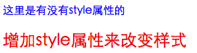

这是为什么呢，其实这里就涉及到一个**选择符**方面的权重优先级，等一下我们再说。那么这个时候我们如果想要所有的`p`标签文字都变成蓝色的话，就需要通过`!important`的方式来提升权重优先级，所以样式部分应该是这样写：

	p { color: blue !important; }
	
那么这个时候我们在页面中看到的就是这样了：

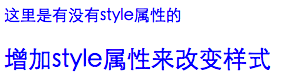

#### №3.4.3 选择符的权重优先级
选择符（或者叫选择器）在**CSS**中的作用是非常大的，每个**HTML**标签的样式都是通过选择符来操作的，只有在**CSS**选择符匹配到相对应的元素才会有样式。具体关于选择符的内容我们后续再谈，这里先知道这么几种涉及到权重基本计算选择符：

* 行内样式，也就是**HTML**标签元素的`style`属性，如 `

`；
* ID选择符，通过**HTML**标签元素的`id`属性来匹配，如 `

`；
* 类选择符，通过**HTML**标签元素的`class`属性来匹配，如 `

`；
* 标签选择符，通过**HTML**标签元素的标签名来匹配，如 `

`；
* 通配符选择符，在**CSS**中直接使用`*`星号来匹配所有**HTML**标签元素，如 `* {color:red}`；

在编写**CSS**的时候，如果一个不小心就会发现页面的样式并不是我们所想要的，那么有部分可能性就是因为没有注意到以上几种选择符的权重优先级。那么我们应该怎么去计算这些权重呢，其实很简单。

##### 通配符选择符
这个是权重最低的一种，虽然我们很少会去用，但偶尔还是会去用的，比如在写**CSS reset**部分的时候：

	* {margin: 0;padding: 0;}

总之吧，无论是在什么时候出现，虽然会把样式作用到**HTML**标签，优先级是最低最低的，如果用数字表示的话，那就是 **0**，一个永远不会被累加的数字。暂且就这么感受吧。

##### 行内样式
这个是权重最高的一种，在页面中经常会看到一些通过**JavaScript**方式将一些**CSS**样式写入到**HTML**的`style`属性中，从而去覆盖其他样式。对于这种方式，如果不是因为**JavaScript**写入的话，平时我们能不这么写的话，那就不要这样写，否则要修改样式就只能通过修改**HTML**文件来实现，而不能利用独立的**CSS**文件。

简单来说，用了行内样式，由于权重过高，而且**CSS**复用性几乎为0，后期维护成本比较大。

##### 选择符权重计算方式
前面提到的**通配符选择符**我们是用了一个 **0** 来表示，那么对于其他几个，我们也同样用数字来表示，然后按照固定模式来计数累加就可以。假设初始值都为 **1** 的时候，那么就有可能是这样的一个情况：

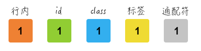

这里只是假设同时都有样式被匹配到某个**HTML**标签中的时候，就比如：

	
增加style属性来改变样式

	
然后在**CSS**部分写的是：

	* {margin: 0;}
	#linxz {margin: 10px;}
	.lin_xz {margin: 20px;}
	p {margin: 30px;}
	
这个时候我们会发现最终的样式其实就是只有`margin: 5px;`这个。

不过在我们编码的时候，并不会这样去写。因为**HTML**标签是可以嵌套的，会有多层子级父级元素，那么就有可能看到这样的一个**HTML**结构（300来层的嵌套，夸张一下）：

	

		

			......
			

				
增加style属性来改变样式

			

			......
		

	

	
然后我们在样式写：

	* {margin: 0;}
	#father_000 #father_001 ...... #father_300 #linxz {margin: 10px;}
	.father_000 .father_001 ...... .father_300 .lin_xz {margin: 20px;}
	div div ..... div p {margin: 30px;}

这样很夸张的嵌套也并不会改变什么，只是让某条**CSS**规则在权重增加很多，但无法跨越过自身的级别去超越权重，大概情况就像这样。

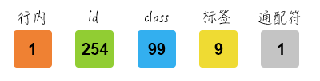

再多的数量也只是会在自身区域中增加，就如上图所示，**254** 个`id`的规则也抵不过一条行内样式的规则，同理 **99** 个`class`的类选择符也抵不过一个`id`的ID选择符。用**CSS**代码来描述的就是：

	* {margin: 0;}
	#linxz {margin: 10px;} /* 这个规则会大于其他选择符，但比行内样式权重低 */
	.father_000 .father_001 ...... .father_300 .lin_xz {margin: 20px;}
	div div ..... div p {margin: 30px;}
	
##### 权重计算中例外的`!important`
在前面我也提到过`!important`这个特殊的关键词，在选择符计算中表现是最为明显的。上面所提到的权重计算都是比较正常的计算，但如果有一些特殊情况出现的时候，比如我们希望`id`中的样式能够覆盖行内样式，那么就需要在`id`选择符的规则中增加一个`!important`。

	#linxz {margin: 10px !important;} /* 这个时候的id选择符优先级是最高 */
	
如果有多条属性要提升权重优先级的话，那么就要增加多个：

	#linxz {
		margin: 10px !important;
		color: red !important;
		font-size: 20px !important;
		padding: 20px; /* 当没有 !important 的时候，权重计算还是跟之前一样 */
	}

关于权重的内容如果有兴趣的话，可以到网络上搜一搜，会找到更多的一些内容，然后再深入了解了解就可以了。